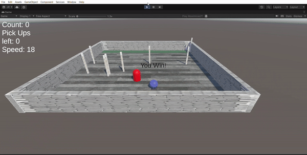
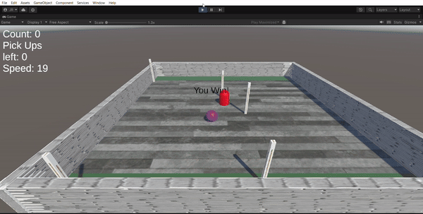
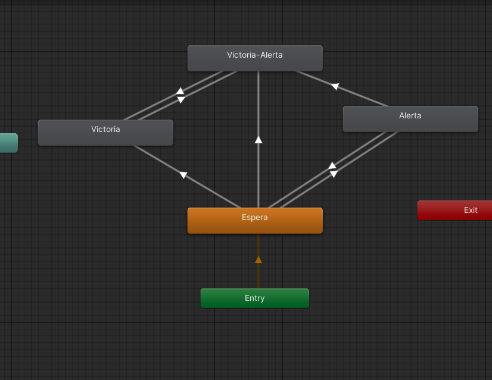

# Rueda la bola :8ball: en Unity
Es un proyecto con base en *Unity* y el tutorial de [Roll a ball](https://learn.unity.com/project/roll-a-ball), aplicando los cambios pedidos.

## Partes del proyecto
Estas son las distintas partes de evaluación del proyecto.

### Personalizar el tablero

De forma incial se le puede **agregar colores**, al *cambiarle* su **material**, en el *menu de inspección del objeto*. Así como poder **agregarles texturas** a los objetos que es con **arrastrar un archivo de imagen** (.png) al objecto deseado, o de estar usando un prefab se lo **puede aplicar al prefab mismo**.


Así como poder **agregarle unas columnas que se dedicaran a obstaculizar** al jugador. Estas apareceran de forma aleatoria en el tablero.


### Enemigo complejo

Teniendo al **enemigo**, se le debe de poner un **comportamiento de movimiento**, en este caso de le puso el **navmesh agent**, para que se mueva de forma autonoma por el tablero, pero se le **asigno al jugador (la bola) como objetivo** para que lo persiga. Un video donde explican el como se usa el navmesh agent es [este](https://www.youtube.com/watch?v=CHV1ymlw-P8).

Para darle un poco mas de **complejidad**, se le dio la **habilidad de aumentar su numero** al enemigo debido a su reducido movimiento.
```csharp
void SpawnEnemy()
    {
        // Genera un nuevo enemigo
        Instantiate(enemyPrefab, transform.position, Quaternion.identity);
    }
```

Así como el darle la habilidad de que **cuando el jugador salte el enemigo iguale su altura**, evitando así que el jugador salte sobre ellos, y los ignore.


La **opción mas avanzada** del enemigo, es que **cuando el jugador se aleje mucho del enemigo**, este **aparecera en su ubicación aproximada**, dando como resultado que el jugador no pueda escapar de el, y que el jugador intente regular su velocidad.
```csharp	
void MoveEnemy()
    {
        // Para ver si el enemigo esta cerca o no del jugador
        float distanceToPlayer = Vector3.Distance(transform.position, target.position);

        if (distanceToPlayer > 10)
        {
            // Para obtener una posición aproximada del jugador
            float randomX = Random.Range(target.position.x - 5, target.position.x + 5);
            float randomZ = Random.Range(target.position.z - 5, target.position.z + 5);

            // Mover el enemigo a la posición aproximada del jugador
            transform.position = new Vector3(randomX , target.position.y, randomZ);
        }
    }
```

### Mecanicas del jugador

Para darle un mayor dinamismo el **jugador sera capaz de aumentar su velocidad si este coje las monedas** que tiene por el mapa.


Para incentivar al jugador a no demorar demasiado, **este perdera un punto de velocidad** por cada segundo que pasa.

```csharp
IEnumerator SpeedReduction()
    {
        while (true)
        {
            yield return new WaitForSeconds(1);
            speed = speed - 1;
            // Actualizar el texto de la velocidad
            SetCountText();
        }
    }
```
El **IEnumerator** es para ser pasado luego a una corutina.

Por motivos de que la velocidad puede volverse demasiado alta, y perder el punto de referencia del mapa, ahora puede que **al jugador caer por debajo del mapa** **vuelva** a la **posición original**.

```csharp
void OutOfBounds()
    {
        // Si la bola se sale del plano, se reinicia
        if (transform.position.y < -10){
            transform.position = new Vector3(0, 0.5f, 0);
            rb.velocity = Vector3.zero;
        }
    }
```

Una demostración de como se ve el la mecanica en el juego.


### Animator

Habiendo creado 3 animaciones, para así **agregar transiciones** y **estados mas complejos**.

El primer **estado** es el de **Idle**, que es la animación de la **bola en reposo**. Este no tiene nada más, es cuando no haya ganado ni tenga enemigos cerca.

El segundo estado en el que se encuentren es el **Alerta** donde la **bola al estar cerca de un enemigo** esta comenzara a **volverse roja** por medio de una transición, este estado puede **transicionar** devuelta a **Espera**, si se deja de estar cerca del enemigo.


El codigo:

```csharp
void hasToBeAlert()
    {
        float distanceToPlayer = Vector3.Distance(transform.position, EnemyPrefab.transform.position);
        if (distanceToPlayer <= 3)
        {
            anim.SetBool("alert", true);
        }

        if(distanceToPlayer > 3 )
        {
            anim.SetBool("alert", false);
        }
    }
```

El tercer estado en el que se pueden encontrar es **Victoria**, el cual una vez se hayan **conseguido todas las monedas**, la bola se **volvera amarilla** por medio de una **transición**, como no vuelven a aparecer mas monedas este estado no puede volver a **Espera**.



El codigo:

```csharp
void hasWin()
    {
       if (CountPickupsLeft() == 0)
        {
            winTextObject.SetActive(true);
        }
    }
```

El ultimo estado es el de **Victoria-Alerta**, este es cuando se **reunen todas las monedas, y cuando tienes un enemigo cerca**, se puede llegar a este estado desde cualquier otro, pero este solo puede volver a **Victoria**, cuando se deje de tener un enemigo cerca.



Debajo es la representación de la maquina de estados.

